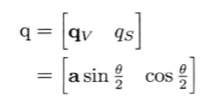

# 《游戏引擎架构》笔记
## 目录
- [《游戏引擎架构》笔记](#%E3%80%8A%E6%B8%B8%E6%88%8F%E5%BC%95%E6%93%8E%E6%9E%B6%E6%9E%84%E3%80%8B%E7%AC%94%E8%AE%B0)
    - [目录](#%E7%9B%AE%E5%BD%95)
    - [第一部分 基础](#%E7%AC%AC%E4%B8%80%E9%83%A8%E5%88%86-%E5%9F%BA%E7%A1%80)
        - [第一章 导论](#%E7%AC%AC%E4%B8%80%E7%AB%A0-%E5%AF%BC%E8%AE%BA)
            - [1.1 典型游戏团队的结构](#11-%E5%85%B8%E5%9E%8B%E6%B8%B8%E6%88%8F%E5%9B%A2%E9%98%9F%E7%9A%84%E7%BB%93%E6%9E%84)
            - [1.2 不同的游戏类型](#12-%E4%B8%8D%E5%90%8C%E7%9A%84%E6%B8%B8%E6%88%8F%E7%B1%BB%E5%9E%8B)
            - [1.3 运行时引擎架构](#13-%E8%BF%90%E8%A1%8C%E6%97%B6%E5%BC%95%E6%93%8E%E6%9E%B6%E6%9E%84)
            - [1.4 工具及资产管道](#14-%E5%B7%A5%E5%85%B7%E5%8F%8A%E8%B5%84%E4%BA%A7%E7%AE%A1%E9%81%93)
        - [第二章 专业工具](#%E7%AC%AC%E4%BA%8C%E7%AB%A0-%E4%B8%93%E4%B8%9A%E5%B7%A5%E5%85%B7)
            - [2.1 版本控制](#21-%E7%89%88%E6%9C%AC%E6%8E%A7%E5%88%B6)
                - [为何使用版本控制](#%E4%B8%BA%E4%BD%95%E4%BD%BF%E7%94%A8%E7%89%88%E6%9C%AC%E6%8E%A7%E5%88%B6)
            - [2.2 Visual Studio](#22-visual-studio)
                - [调试发布生成的窍门](#%E8%B0%83%E8%AF%95%E5%8F%91%E5%B8%83%E7%94%9F%E6%88%90%E7%9A%84%E7%AA%8D%E9%97%A8)
            - [2.3 剖析工具](#23-%E5%89%96%E6%9E%90%E5%B7%A5%E5%85%B7)
            - [2.4 内存泄露和损坏检测](#24-%E5%86%85%E5%AD%98%E6%B3%84%E9%9C%B2%E5%92%8C%E6%8D%9F%E5%9D%8F%E6%A3%80%E6%B5%8B)
            - [2.5 其他工具](#25-%E5%85%B6%E4%BB%96%E5%B7%A5%E5%85%B7)
        - [第三章 游戏软件工程基础](#%E7%AC%AC%E4%B8%89%E7%AB%A0-%E6%B8%B8%E6%88%8F%E8%BD%AF%E4%BB%B6%E5%B7%A5%E7%A8%8B%E5%9F%BA%E7%A1%80)
            - [3.1 重温 C++ 及最佳实践](#31-%E9%87%8D%E6%B8%A9-c-%E5%8F%8A%E6%9C%80%E4%BD%B3%E5%AE%9E%E8%B7%B5)
                - [基本概念](#%E5%9F%BA%E6%9C%AC%E6%A6%82%E5%BF%B5)
                - [编码标准](#%E7%BC%96%E7%A0%81%E6%A0%87%E5%87%86)
            - [3.2 C/C++ 的数据、代码及内存](#32-cc-%E7%9A%84%E6%95%B0%E6%8D%AE%E3%80%81%E4%BB%A3%E7%A0%81%E5%8F%8A%E5%86%85%E5%AD%98)
            - [3.3 捕捉及处理错误](#33-%E6%8D%95%E6%8D%89%E5%8F%8A%E5%A4%84%E7%90%86%E9%94%99%E8%AF%AF)
        - [第四章 游戏所需的三维数学](#%E7%AC%AC%E5%9B%9B%E7%AB%A0-%E6%B8%B8%E6%88%8F%E6%89%80%E9%9C%80%E7%9A%84%E4%B8%89%E7%BB%B4%E6%95%B0%E5%AD%A6)
            - [4.1 坐标系](#41-%E5%9D%90%E6%A0%87%E7%B3%BB)
            - [4.2 矢量](#42-%E7%9F%A2%E9%87%8F)
            - [4.3 矩阵](#43-%E7%9F%A9%E9%98%B5)
            - [四元数](#%E5%9B%9B%E5%85%83%E6%95%B0)
            - [产生随机数](#%E4%BA%A7%E7%94%9F%E9%9A%8F%E6%9C%BA%E6%95%B0)
    - [第二部分 低阶引擎系统](#%E7%AC%AC%E4%BA%8C%E9%83%A8%E5%88%86-%E4%BD%8E%E9%98%B6%E5%BC%95%E6%93%8E%E7%B3%BB%E7%BB%9F)
        - [第五章 游戏支持系统](#%E7%AC%AC%E4%BA%94%E7%AB%A0-%E6%B8%B8%E6%88%8F%E6%94%AF%E6%8C%81%E7%B3%BB%E7%BB%9F)
            - [子系统的启动和终止](#%E5%AD%90%E7%B3%BB%E7%BB%9F%E7%9A%84%E5%90%AF%E5%8A%A8%E5%92%8C%E7%BB%88%E6%AD%A2)
            - [内存管理](#%E5%86%85%E5%AD%98%E7%AE%A1%E7%90%86)
            - [容器](#%E5%AE%B9%E5%99%A8)
            - [字符串](#%E5%AD%97%E7%AC%A6%E4%B8%B2)

## 第一部分 基础
### 第一章 导论
#### 1.1 典型游戏团队的结构
1. 工程师（engineer）

    - **运行时**程序员（runtime programmer）
    - **工具**程序员（tool programmer）

2. 艺术家（artist）

    - **概念艺术家**（concept artist）
    - **三维建模师**（3D modeler）
    - **纹理艺术家**（texture artist）
    - **灯光师**（lighting artist）
    - **动画师**（animator）
    - **动画捕捉演员**（motion capture actor）
    - **音效设计师**（sound designer）
    - **配音演员**（voice actor）
    - **作曲家**（composer）

3. 游戏设计师（game designer）

4. 制作人（producer）

5. 其他工作人员

6. 发行商（publisher）及工作室

#### 1.2 不同的游戏类型
- 第一人称射击（first person shooting，FPS）

- 平台（platformer）及其他第三人称游戏（third person game）

- 格斗游戏（fighting game）

- 竞速游戏（racing game）

- 实时策略游戏（real-time strategy，RTS）

- 大型多人在线游戏（massively multiplayer online game，MMOG）

- 体育游戏（sports game）

- 角色扮演游戏（role playing game，RPG）

- 上帝模拟游戏（god game）

- 环境或社会模拟游戏（environmental/social simulation）

- 解谜游戏（puzzle game）

- 非电子游戏的移植，如象棋、围棋等

- 基于网页的游戏

- 其他游戏类型

#### 1.3 运行时引擎架构
1. 目标硬件

    代表用来执行游戏的计算机系统或游戏主机

2. 设备驱动程序

    设备驱动程序（device driver）是由操作系统或硬件厂商提供的最低阶软件组件。驱动程序负责管理硬件资源，也隔离了操作系统及上层引擎，使上层的软件无须理解不同硬件版本的通信细节差异

3. 操作系统

    操作系统（operating system，OS）是一直运行的，协调一台计算机上多个程序的执行

4. 第三方软件开发包和中间件

    大部分游戏引擎都会借用许多第三方软件开发包（software development kit，SDK）及中间件（middleware）

5. 平台独立层

    平台独立层（platform independence layer）在硬件、驱动程序、操作系统及其他第三方软件之上，以此把其余的引擎部分和大部分底层平台隔离。

6. 核心系统

    游戏引擎以及其他大规模复杂 C++ 应用软件，都需要一些有用的实用软件（utility），将这类软件称为**核心系统（core system）**

    常见的功能有：

    - 断言（assertion）
    - 内存管理
    - 数学库
    - 自定义数据结构及算法

7. 资源管理

    每个游戏引擎都有某种形式的资源管理器，提供一个或一组统一接口，去访问任何类型的游戏资产及其他引擎输入数据

8. 渲染引擎

    任何游戏引擎中，渲染引擎是最大及最复杂的组件之一

    渲染引擎的设计通常采用**分层架构（layered architecture）**

9. 剖析与调试工具

    剖析游戏性能，以便优化

    调试功能包括调试用绘图、游戏内置菜单、主控台，以及能够录制及回放游戏过程的功能，方便测试与调试

10. 碰撞和物理

    碰撞检测（collision detection）对每个游戏都很重要

    一些游戏包含真实或半真实的动力学模拟（dynamics simulation），在游戏业界称为**物理系统（physics system）**

11. 动画

    含有机或半有机角色（人类、动物、卡通角色，甚至机器人）的游戏，就需要动画系统

    五种基本动画：

    - 精灵/纹理动画（sprite/texture animation）
    - 刚体层次结构动画（rigid body hierarchy animation）
    - 骨骼动画（skeletal animation）
    - 每顶点动画（per-vertex animation）
    - 变形目标动画（morph target animation）

12. 人体学接口设备

    游戏皆要处理玩家输入，而输入来自多个**人体学接口设备（human interface device，HID）**

    常见的 HID：

    - 键盘和鼠标
    - 游戏手柄（joypad)
    - 其他专用游戏控制器，如方向盘、鱼竿、跳舞毯、Wii遥控器（WiiMote）等

    该组件有时称作 **玩家输入/输出（player I/O）** 组件

13. 音频

14. 在线多人/网络

    多人游戏最少有 4 种基本形式：

    - 单屏多人（single-screen multiplayer）
    - 切割屏多人（split-screen multiplayer）
    - 网络多人（networked multiplayer）
    - 大型多人在线游戏（massively multiplayer online game，MMOG）

15. 游戏性基础系统

    **游戏性（gameplay）** 这一术语是指：游戏内进行的活动、支配游戏虚拟世界的规则（rule）、玩家角色的能力（也称为玩家机制/player mechanics）、其他角色和对象的能力、玩家的长短期目标（goal and objective）

    为了连接低阶的引擎子系统和游戏性代码，多数游戏引擎会引入一个软件层，称其为 **游戏性基础层（gameplay foundation layer）**

16. 个别游戏专用子系统

#### 1.4 工具及资产管道
1. 数字内容创作工具

    游戏本质上是多媒体应用。游戏引擎的输入数据形式广泛，例如三维网格数据、纹理位图、动画数据、音频文件等。所有源数据皆由美术人员使用 **数字内容创作（digital content creation，DCC）** 应用软件制作

2. 资产调节管道

    DCC 应用软件所使用的数据格式，鲜有适用直接用于游戏的，主要原因有：

    1. DCC 软件在内存中的数据模型，通常比游戏所需的复杂得多

    2. 在游戏中读取 DCC 软件格式的文件，其速度通常过慢，而有些格式更是不公开的专有格式

    当数据自 DCC 软件导出后，有时必须再处理，才能放在游戏引擎里使用。从 DCC 到游戏引擎的管道，有时候称为 **资产调节管道（asset conditioning pipeline）**

3. 三维模型/网格数据

    在游戏中可见的几何图形，通常由两种数据组成：

    1. 笔刷几何图形

        **笔刷几何图形（brush geometry）** 由 **凸包（convex hull）** 集合定义，每个凸包则由多个平面定义

    2. 三维模型（网格）

        对细致的场景元素而言，**三维模型（3D model，也称为 网格/mesh）** 优于笔刷几何图形

4. 骨骼动画数据

    **骨骼网格（skeletal mesh）** 是一种特殊的网格，为关节动画而绑定到 **骨骼层次结构（skeletal hierarchy）** 之上

    骨骼网格在看不见的骨骼上形成皮肤，因此，骨骼网格有时候又称为**皮肤（skin）**

5. 音频数据

    **音频片段（audio clip）** 通常由 Sound Forge 或其他音频制作工具导出，有不同的格式和采样率（sampling rate）

6. 粒子系统数据

7. 游戏世界数据及世界编辑器

    游戏引擎的所有内容都集合在游戏世界


### 第二章 专业工具
#### 2.1 版本控制
**版本控制系统（version control system）** 容许多位开发者在同一组文件上工作

版本控制系统容许多位用户同时修改文件，甚至修改同一个文件，并避免互相破坏成果。因为版本控制系统主要供程序员管理源代码，所以有时候又称为 **源代码控制（source control）**

##### 为何使用版本控制
版本控制系统有以下功能：

- 提供中央版本库（repository）
- 保留每个源文件的所有更改记录
- 提供为某些版本加上标签的机制，供以后提取已加标签的版本
- 容许代码从主生产线上建立分支（branch）

#### 2.2 Visual Studio
##### 调试发布生成的窍门
- **学习在调试器中阅读及单步执行反汇编**
- **运用寄存器去推理变量的值或地址**
- **使用地址去检查变量及对象内容**
- **利用静态和全局变量**
- **修改代码**

#### 2.3 剖析工具
**剖析器（profiler）** 能量度代码的执行时间，并能告之每个函数所花的时间

剖析器大致可分为两类：

- **统计式剖析器（statistical profiler）**：此类剖析器是 **不唐突的（unobtrusive）**，意指启动剖析器后，目标代码的执行速度差不多和没使用剖析器时相同

- **测控式剖析器（instrumental profiler）**：此类剖析器能提供最精确、最详尽的计时数据，但是却要以不能实时运行程序为代价——当启动剖析器后，目标程序慢如蜗牛

#### 2.4 内存泄露和损坏检测
使用此类工具可以帮助程序员检测内存泄漏和损坏，避免错误的发生

- **内存泄漏（memory leak）**

    如果一块内存在分配后永不释放，就会产生内存泄漏。

- **内存损坏（memory corruption）**

    程序不慎把数据写进内存的错误位置，覆盖了该位置原来的重要数据，也同时未能把数据写到**应该**写的位置。

#### 2.5 其他工具
- **区别工具（difference/diff tool）**：区别工具是用来比较一个文本文档的两个版本，找出版本之间的差异

- **三路合并工具（three-way merge tool）**：当两个人修改同一个文件时，就会产生两组区别。能把两组区别合并成为含两人改动的最终文件的工具，称为三路合并工具

- **十六进制编辑器（hex editor）**：十六进制编辑器用于查看及修改二进制文件的内容

### 第三章 游戏软件工程基础
#### 3.1 重温 C++ 及最佳实践
##### 基本概念
- **类（class）** 是属性（数据）和行为（代码）的集合，共同组成既有用又有意义的整体。类可视为 **规格（specification）**，这些规格描述类的个别 **实例（instance）**——又称为 **对象（object）**。

- **封装（encapsulation）** 是指，对象向外只提供有限接口，隐藏对象的内部状态和实现细节。

- **继承（inheritance）** 能借着**延伸**现有的类去定义新的类。新类可修改或延伸现有类的数据、接口和行为。

- **多重继承（multiple inheritance, MI）** 是指一个类有一个以上的父类。

- **多态（polymorphism）** 是一种语言特征，容许采用单一**共同接口**操作一组不同类型的对象。

- **合成（composition）** 是指，使用**一组互动的**对象去完成高阶任务。

##### 编码标准
1. 编码标准存在的原因：

    1. 一些标准使代码更易读、更易理解、更易维护。

    2. 另一些约定能预防程序员做蠢事，自找麻烦。

2. 编码标准内容：

    - **接口为王**：保持接口（`.h`文件）整洁、简单、极小、易于理解，并有良好注释。

    - **好名字促进理解及避免混淆**：持续使用能直接反映类、函数、变量用途的直观名字。

    - **不要给命名空间添乱**：使用 C++ 命名空间或统一的名字前缀，以确保自己的符号（symbol）不会和其他库的符号冲突。

    - **遵从最好的 C++ 实践**

    - **始终如一**：始终遵守编码标准内容。

    - **显露错误**：所谓最“整洁”的代码，并不需要是表面看起来简洁整齐的代码，而更重要的是，代码的编写方法能**容易显露**常见的编程错误。

#### 3.2 C/C++ 的数据、代码及内存
- 大于8位（1字节）的值称为 **多字节量（multi-byte quantity）**。

- 内存中存储多字节整数有两种方式：

    - **小端（little-endian）**：若微处理器存储多字节值的最低有效字节于较低的内存位置，则该微处理器就是**小端**处理器。

    - **大端（big-endian）**：若微处理器存储多字节值的最高有效字节于较低的内存位置，则该微处理器就是**大端**处理器。

- 处理字节序问题的方法：

    1. 所有数据以文字方式写入文件。多字节数值以一串十进制数字，每数字一个字节写入。但此方法会浪费磁盘空间。

    2. 工具先转换数据字节序，然后再把转换后的数据写进二进制文件。

- 声明与定义：

    - **声明（declaration）** 是数据对象或函数的描述。声明使编译器知道实体（数据对象或函数）的名字，以及其数据类型或函数签名（function signature，即函数的返回值类型、一个至多个参数类型）。

    - **定义（definition）** 则是程序中个别内存区域的描述。此内存区域可能用来放置变量、struct或class的实例，以及函数的机器码。

- **可执行映像**一般最少由以下4个段组成：

    1. **代码段（text/code segment）** ：此段包含程序中定义的全部函数的可执行机器码。

    2. **数据段（data segment）** ：此段包含全部**获初始化**的全局及静态变量。链接器为这些变量分配所需内存，其内存布局将会和程序执行时完全一样，并且链接器会填入适当的初始值。

    3. **BSS段（BSS segment）** ：“BSS”是过时的名字，原意是“由符号开始的块（block started by symbol）”。BSS段包含程序中定义的所有**未初始化**全局变量和静态变量。

    4. **只读数据段（read only data segment）** ：此段又称为**rodata**段，包含程序中定义的只读（常量）全局变量。

- 程序堆栈：

    当可执行程序被载入内存时，操作系统会保留一块称为 **程序堆栈（program stack）** 的内存。当调用函数时，一块连续的内存就会压入栈，此内存块称为 **堆栈帧（stack frame）**。若函数`a()`调用函数`b()`，函数`b()`的新堆栈帧就会压入`a()`堆栈帧之上。当`b()`返回时，其堆栈帧就会弹出，并于调用`b()`之后的位置继续执行`a()`。

    堆栈帧存储3类数据：

    1. 堆栈帧存储调用函数的 **返回地址（return address）**。当函数返回时，就可以凭这一数据继续执行调用方的函数。

    2. 堆栈帧保存相关**CPU寄存器**的内容。当函数返回时，各寄存器就会还原至调用方可继续执行的状态。

    3. 堆栈帧也包含函数里的所有 **局部变量（local variable）**，或称为 **自动变量（automatic variable）**。

- `static`关键字的不同含义

    - 当用于文件作用域时，`static`意味着“限制变量或函数的可见性，只有本`.cpp`文件才能使用该变量或函数”。

    - 当用于函数作用域时，`static`意味着“变量为全局，非自动，只在本函数内可见”。

    - 当用于`struct`或`class`声明时，`static`意味着“该变量非一般成员变量，而是类似于全局变量”。

#### 3.3 捕捉及处理错误
- **用户错误（user error）** ：指用户做了些不正确的事情而引发的错误。

- **程序员错误（programmer error）** ：指由代码本身的bug所导致的错误。

- 正确地使用**断言**极为重要。断言只应用于捕捉程序本身的bug，永远**不要**用来捕捉用户错误。

### 第四章 游戏所需的三维数学
#### 4.1 坐标系
- **笛卡尔坐标系（Cartesian coordinate system）** ：使用 2 个或 3 个互相垂直的轴，来描述二维或三维空间的位置。

- **圆柱坐标系（cylindrical coordinate system）** ：此坐标系由 3 部分组成，分别是垂直“高度”轴 h、从垂直轴发射出来的辐射轴 r、和 yaw 角度 θ。

- **球坐标系（spherical coordinate system）** ：此坐标系由 3 部分组成，分别是俯仰角（pitch）phi（φ）、偏航角（yaw）theta（θ）和半径长度 r。

#### 4.2 矢量
- **矢量（vector）** 指n维空间中包含 **模（magnitude）** 和**方向**的量。矢量可绘画成**有向线段**，线段自一点（**尾**）延伸至另一点（**头**）。

- 点和方向的加减：

    - 方向 + 方向 = 方向

    - 方向 - 方向 = 方向

    - 点 + 方向 = 点

    - 点 - 点 = 方向

    - 点 + 点 = **无意义**

- **单位矢量（unit vector）** 即是模（长度）为 1 的矢量。

- **矢量乘积**：

    - **点积（dot product）**，又称为 **标量积（scalar product）** 或 **内积（inner product）**。

        - 两矢量的点积结果是一个**标量**，此标量定义为两矢量中每对分量乘积之和：

            <strong>a</strong> \* <strong>b</strong> = a<sub>x</sub>b<sub>x</sub> + a<sub>y</sub>b<sub>y</sub> + a<sub>z</sub>b<sub>z</sub> = d （一个标量）

        - 点积也可以写成两矢量的模相乘后，再乘以两矢量间夹角的余弦：

            <strong>a</strong> \* <strong>b</strong> = |<strong>a</strong>||<strong>b</strong>|cos<i>θ</i>

        - 点积符合 **交换律（commutative）**，以及在加法上符合 **分配律（distributive）**：

            <strong>a</strong> \* <strong>b</strong> = <strong>b</strong> \* <strong>a</strong>

            <strong>a</strong> \* (<strong>b</strong> + <strong>c</strong>) = <strong>a</strong> \* <strong>b</strong> + <strong>a</strong> \* <strong>c</strong>

        - 点积可结合标量乘法：

            (<i>s</i><strong>a</strong>) \* <strong>b</strong> = <strong>a</strong> \* <i>s</i><strong>b</strong> = <i>s</i>(<strong>a</strong> \* <strong>b</strong>)

        - 模的平方可以用矢量和自身的点积计算，而要计算矢量的模则可以将点积开平方：

            |<strong>a</strong>|<sup>2</sup> = <strong>a</strong> \* <strong>a</strong>

            |<strong>a</strong>| = √(<strong>a</strong> \* <strong>a</strong>)

        - 点积判定（dot product test）：

            **共线**：(<strong>a</strong> \* <strong>b</strong>) = |<strong>a</strong>||<strong>b</strong>| = <i>a</i><i>b</i> （即夹角精确地为 0°。如果 **a** 和 **b** 都是**单位矢量**，则点积为 +1）

            **共线但方向相反**：(<strong>a</strong> \* <strong>b</strong>) = -<i>a</i><i>b</i> （即夹角精确地为 180°。若 **a** 和 **b** 都是**单位矢量**且共线，则点积为 -1）

            **垂直**：(<strong>a</strong> \* <strong>b</strong>) = 0 （即夹角为 90°）

            **相同方向**：(<strong>a</strong> \* <strong>b</strong>) > 0 （即夹角小于 90°）

            **相反反向**：(<strong>a</strong> \* <strong>a</strong>) < 0 （即夹角大于 90°）

    - **叉积（cross product）**，又称为 **矢量积（vector product）** 或 **外积（outer product）**。

        - 两个矢量的叉积会产生另一个**矢量**，该矢量**垂直**于原来的两个相乘矢量。

            <strong>a</strong> × <strong>b</strong> = [(a<sub>y</sub>b<sub>z</sub> - a<sub>z</sub>b<sub>y</sub>), (a<sub>z</sub>b<sub>x</sub> - a<sub>x</sub>b<sub>z</sub>), (a<sub>x</sub>b<sub>y</sub> - a<sub>y</sub>b<sub>x</sub>)]

            = (a<sub>y</sub>b<sub>z</sub> - a<sub>z</sub>b<sub>y</sub>)<b>i</b> + (a<sub>z</sub>b<sub>x</sub> - a<sub>x</sub>b<sub>z</sub>)<b>j</b> + (a<sub>x</sub>b<sub>y</sub> - a<sub>y</sub>b<sub>x</sub>)<b>k</b>

        - 叉积的模等于两矢量各自的模的积再乘以两矢量夹角的正弦：

            |<strong>a</strong> × <strong>b</strong>| = |<strong>a</strong>||<strong>b</strong>|sin<i>θ</i>

        - 叉积**不**符合**交换律**，然而，叉积符合**反交换律**：

            <strong>a</strong> × <strong>b</strong> = -<strong>b</strong> × <strong>a</strong>

        - 叉积在加法上符合分配率：

            <strong>a</strong> × (<strong>b</strong> + <strong>c</strong>) = (<strong>a</strong> × <strong>b</strong>) + (<strong>a</strong> × <strong>c</strong>)

        - 叉积和标量乘法可如下结合：

            (<i>s</i><strong>a</strong>) × <strong>b</strong> = <strong>a</strong> × (<i>s</i><strong>b</strong>) = <i>s</i>(<strong>a</strong> × <strong>b</strong>)

- **线性插值（linear interpolation）** 是一个简单的数学运算，用来计算两个已知点的中间点。此运算的名称通常简写成`LERP`。此运算定义如下，其中 β 介于并包含 0~1：

    <b>L</b> = <b>LERP</b>(<b>A</b>, <b>B</b>, β) = (1 - β)<b>A</b> + β<b>B</b>

    = [(1 - β)A<sub>x</sub> + βB<sub>x</sub>, (1 - β)A<sub>y</sub> + βB<sub>y</sub>,  (1 - β)A<sub>z</sub> + βB<sub>z</sub>]

#### 4.3 矩阵
- **矩阵（matrix）** 是由 m × n 个标量组成的长方形数组。矩阵便于表示线性变换（transformation），如平移（translation）、旋转（rotation）和缩放（scaling）。

- 可以视 3 × 3 矩阵的行和列为三维矢量。若某 3 × 3 矩阵中的所有行及列矢量为单位矢量，则该矩阵称为 **特殊正交矩阵（special orthogonal matrix）**、**各向同性矩阵（isotropic matrix）** 或 **标准正交矩阵（orthonormal matrix）**。

- 某些条件下，4 × 4 矩阵可表示任意三维**变换**，包括**平移**、**旋转**和**缩放**。这种矩阵称为**变换矩阵**。

- 矩阵乘法不符合交换律，即：

    <b>A</b><b>B</b> ≠ <b>B</b><b>B</b>

- 点和矢量都可以表示为 **行矩阵（row matrix）**（1 × n）或 **列矩阵（column matrix）**（n × 1），其中 n 为使用中的空间维度。

    - 要把 1 × n 行矢量乘以 n × n 矩阵，矢量必须置于矩阵的**左方**

    - 要把 n × n 矩阵乘以 n × 1 列矢量，矢量必须置于矩阵的**右方**

- **单位矩阵（identity matrix）** 是指，它乘以任何其他矩阵，都会得出和原来一样的矩阵。单位矩阵通常写作 **I**。单位矩阵是正方形矩阵，对角线上的元素皆为 1，其他元素为 0：

    ```
           [1 0 0]
    I3x3 = [0 1 0]
           [0 0 1]
    ```

    <b>A</b><b>I</b> = <b>I</b><b>A</b> = <b>A</b>

- 矩阵 A 的 **逆矩阵（inverse matrix）**（写作**A**<sup>-1</sup>）能**还原**矩阵 A 的变换。特别注意：矩阵串接后求逆，相当于**反向串接**各个矩阵的逆矩阵。

    (**ABC**)<sup>-1</sup> = **C**<sup>-1</sup>**B**<sup>-1</sup>**A**<sup>-1</sup>

- 矩阵 M 的 **转置（transpose）** 写作 **M**<sup>T</sup>。转置矩阵就是把原来矩阵以主对角线（diagonal）为对称轴做反射，即行与列交换。

    (**ABC**)<sup>T</sup> = **C**<sup>T</sup>**B**<sup>T</sup>**A**<sup>T</sup>

- 当点或矢量从三维延伸至四维，便称为 **齐次坐标（homogeneous coordinates）**。

- 在齐次坐标中，可以把点的 <i>w</i> 分量设为 1，而把方向矢量的 <i>w</i> 分量设为 0。

- 4 × 4 **变换矩阵**可切割为 4 个组成部分：

    

    - 左上角 3 × 3 矩阵 **U**，代表旋转及/或缩放

    - 1 × 3 平移矢量 **t**

    - 3 × 1 零矢量 **0** = [0 0 0]<sup>T</sup>

    - 矩阵右下角的标量 1

    - 平移

        

        缩写：

        

    - 旋转

        

    - 缩放

        

        缩写：

        

- 物理学上，一族坐标轴代表一个参考系（frame of reference），有时候称一组轴为 **坐标系（coordinate frame，或简称 frame）**。游戏业界则会使用 **坐标空间（coordinate space）**一词，或简称 **空间（space）**，来表示一组坐标轴。

- 常用坐标空间：

    - **模型空间**：使用 Maya 或 3ds Max 之类的工具去建立三角形网络，三角形顶点的位置是相对于一个笛卡尔坐标系，称次坐标系为 **模型空间（model space）**，也可称为 **物体空间（object space）** 或 **局部空间（local space）**。

    - **世界空间（world space）** ：是一个固定坐标空间。游戏世界中所有物体的位置、定向和缩放都会用此空间表示。

    - **观察空间（view space）** ：又称为 **摄像机空间（camera space）**，是固定于摄像机的坐标系。

- 变换法矢量

    - **法矢量**是一种特殊的矢量，因为它除了是单位矢量（通常情况是）外，法矢量还有附加要求——维持与对应的表面或平面**垂直**。

#### 四元数
- **单位长度**四元数：<i>q</i><sub>x</sub><sup>2</sup> + <i>q</i><sub>y</sub><sup>2</sup> + <i>q</i><sub>z</sub><sup>2</sup> + <i>q</i><sub>w</sub><sup>2</sup> = 1

- **单位四元数**可以视觉化为三维矢量加上第四维的标量坐标。矢量部分 <b>q</b><sub><i>V</i></sub> 是旋转的单位轴乘以旋转半角的正弦；而标量部分 <i>q</i><sub><i>S</i></sub> 是旋转半角的余弦。

    

    其中 <b>a</b> 为旋转轴方向的单位矢量，而 <i>θ</i> 为旋转角度。旋转方向使用**右手法则**。

- **四元数乘法**：给定两个四元数 p 和 q，分别代表旋转 **P** 和 **Q**，则 pq 代表两旋转的合成旋转（即旋转 **Q** 之后再旋转 **P**），此乘法称为格拉斯曼积（Grassmann product）。

    

- **共轭四元数**：写成 q<sup>*</sup>

    

    共轭是**矢量部分**求反，**标量部分**不变。

- **逆四元数**：对四元数 q 求 **逆（inverse）** 写为 q<sup>-1</sup>，逆四元数和原四元数的乘积会变成标量 1（即 qq<sup>-1</sup> = 0**i** + 0**j** + 0**k** + 1）。四元数 [0 0 0 1] 代表零旋转（从 sin0 = 0 代表前 3 个分量并且 cos0 = 1 代表第 4 个分量）。其定义如下：

    

    由于我们使用的四元数都是用于代表三维旋转的，这些四元数都是单位长度的（即 |q| = 1）。在这种情况下，共轭和逆四元数是相等的：

    

- 积的共轭及逆四元数

    四元数积（pq）的共轭，等于求各个四元数的共轭后，以相反次序相乘：

    

    四元数积的逆等于求各个四元数的逆后，以相反次序相乘：

    

    **这种相反次序运算，同样适用于矩阵积的转置和逆。**

- 以四元数旋转矢量

    将矢量重写为**四元数形式**。给定矢量 **v**，可以把它写成对应的四元数 v = [**v** 0] = [<i>v</i><sub>x</sub> <i>v</i><sub>y</sub> <i>v</i><sub>z</sub> 0]。

    以四元数 q 旋转矢量 **v**，须用 q 前乘以矢量 **v** （以 **v** 的对应四元数形式），再后乘以逆四元数 q<sup>-1</sup>：

    

    因为旋转用的四元数都是单位长度的，所以使用共轭也是等同的：

    

- 四元数的串接

    和基于矩阵的变换一样，四元数可以通过相乘**串接**旋转。假设 3 个四元数 q<sub>1</sub>、q<sub>2</sub>、q<sub>3</sub> 分别表示不同旋转，并对应其等价的矩阵 **R**<sub>1</sub>、**R**<sub>2</sub>、**R**<sub>3</sub>。希望首先进行旋转 1，接着旋转 2，最后旋转 3，则合成旋转矩形 **R**<sub>net</sub> 和其旋转矢量 **v** 如下：

    

    相似的，合成旋转四元数 q<sub>net</sub> 和其旋转矢量 **v** （以四元数形式表示的 **v**），如下：

    

- 等价的四元数和矩阵

    任何三维旋转都可以从 3 × 3 矩阵表达方式 **R** 和四元数表达方式 q 之间自由转换。若设 q = [**q**<i>v</i> <i>q</i><i>S</i>] = [<i>q</i><i>v</i><sub>x</sub> <i>q</i><i>v</i><sub>y</sub> <i>q</i><i>v</i><sub>z</sub> <i>q</i><i>S</i>] = [<i>x</i> <i>y</i> <i>z</i> <i>w</i>]

    

    给定 **R** 也可用以下方式求 q

    ```[c]
    void MatrixToQuaterion(
        const float R[3][3],
        float       q[/*4*/])
    {
        float trace = R[0][0] + R[1][1] + R[2][2];

        if (trace > 0.0f)
        {
            float s = sqrt(trace + 1.0f);
            q[3] = s * 0.5f;

            float t = 0.5f / s;
            q[0] = (R[2][1] - R[1][2]) * t;
            q[1] = (R[0][2] - R[2][0]) * t;
            q[2] = (R[1][0] - R[0][1]) * t;
        }
        else
        {
            int i = 0;
            if (R[1][1] > R[0][0]) i = 1;
            if (R[2][2] > R[i][i]) i = 2;

            static const int next[3] = { 1, 2, 0 };
            int j = next[i];
            int k = next[j];

            float s = sqrt((R[i][i]
                        -  (R[j][j] + R[k][k]))
                        +   1.0f);

            q[i] = s * 0.5f;

            float t;
            if (s != 0.0f)
                t = 0.5f / s;
            else
                t = s;

            q[3] = (R[k][j] - R[j][k]) * t;
            q[j] = (R[j][i] - R[i][j]) * t;
            q[k] = (R[k][i] - R[i][k]) * t;
        }
    }
    ```

#### 产生随机数
- 线性同余产生器（linear congruential generator， LCG）

- 梅森旋转算法（Mersenne Twister，MT)

    优点：

    1. MT 有庞大的周期：2<sup>19937</sup>-1
    2. MT 有非常高阶的均匀分布维度（dimensional equidistribution）
    3. MT 通过了多个统计随机性的测试
    4. MT 很快

- 所有之母及 Xorshift

## 第二部分 低阶引擎系统
### 第五章 游戏支持系统
#### 子系统的启动和终止
使用 C++ 实现游戏引擎时，由于 C++ 静态变量和全局变量构造函数和析构函数的调用时机不可控，因此我们需要手动管理游戏子系统初始化及回收逻辑。

一般我们可以为每一个系统实现`startUp()`方法和`shutDown()`方法，再由我们在**游戏开始时**按照预期顺序，依次调用`startUp()`方法对各个子系统进行初始化，在**游戏结束时**按照预期顺序，依次调用`shutDown()`方法对各个子系统进行终止处理。

#### 内存管理
内存对效能的影响有两方面：
1. 以 `malloc()` 或 C++ 的全局 `new` 运算符进行**动态内存分配（dynamic memory allocation）**，是非常慢的操作。要提升效能，最佳方法是尽量避免动态分配内存，不然也可利用自制的内存分配器来大大减低分配成本。

2. 许多时候在 CPU 上，软件的效能受其**内存访问模式（memory access pattern）**主宰。可以看到，将数据置于细小**连续**的内存块，相比把数据分散至广阔的内存地址，CPU 对前者的操作会高效得多。

- 优化动态内存分配

    通过 `malloc()/free()` 或 C++ 的全局 `new/delete` 运算符动态分配内存——又称为**堆内存（heap allocation）**——通常是非常慢的。

    低效主要来自两个原因：1. 堆分配器（heap allocator）是通用的设施，需要大量的管理开销。2. 在多数操作系统上，`malloc()/free()`必然会从用户模式（user mode)切换至内核模式（kernel mode），处理请求，再切换至原来的程序，这些上下文切换（context-switch）可能会耗费很多时间。

    游戏开发中一个常见的经验法则：**维持最低限度的堆分配，并且永不在紧凑循环中使用堆分配**

    常见的内存分配器：

    - 基于堆栈的分配器

    - 双端堆栈分配器

    - 池分配器

    - 含对齐功能的分配器

    - 单帧和双缓冲内存分配器

- 内存碎片（memory fragmentation）：问题在于，就算有足够的自由内存，分配请求仍然可能失败。在支持**虚拟内存（virtual memory）**的操作系统上，并非大问题。

    其中有两个方法可以用来解决该问题：

    - 以堆栈和池分配器**避免**内存碎片

    - 碎片的**整理**以及指针的**重定位**

- 缓存一致性

    - 避免数据缓存命中失败：把数据编排进连续的内存块中，尺寸越小越好，并且要**顺序**访问这些数据。

    - 避免指令缓存命中失败：1. 高效能代码的体积**越小越好**，体积以机器码指令数目为单位。2. 在性能关键的代码段落中，**避免使用函数**。3. 若要调用某函数，就把该函数置于**最接近**调用函数的地方，最好是紧接调用函数的前后，而**不要**把该函数置于另一翻译单元。4. 谨慎使用**内联函数**。

#### 容器
- 常见容器

    1. **数组（array）**：有序、连续存储数据的元素集合，使用索引存取元素。

    2. **动态数组（dynamic array）**：可在运行期动态改变长度的数组。

    3. **链表（linked list）**：有序集合，但其数据在内存中是以非连续方式存储的。

    4. **堆栈（stack)**：在新增和移除数据时，采用后进先出（last-in-first-out，LIFO）的模式，也即压入（push）和弹出（pop）操作。

    5. **队列（queue）**：在新增和移除数据时，采用先进先出（first-in-first-out，FIFO）的模式。

    6. **双端队列（double-ended queue，deque）**：可以在两端高效地插入及移除数据。

    7. **优先队列（priority queue）**：加入元素后，可用事先定义了的优先值计算方式，高效地弹出队列中优先值最高的元素。

    8. **树（tree）**

    9. **二叉查找树（binary search tree，BST）：二叉查找树中的每个节点最多含有两个子节点。由于节点按预先定义的方式排列，任何时候都可以按该排列方式遍历整棵树。二叉查找树有多种类型，包括**红黑树（red-black tree）**、**伸展树（splay tree）**、AVL树（AVL tree）**。

    10. **二叉堆（binary heap）**：采用完全（或接近完全）二叉树的数据结构，通常（静态或动态）数组存储。根节点必然是堆中最大（或最小）的元素。

    11. **字典（dictionary）**：由键值对（key-value pair）组成的表。

    12. **集合（set）**：保证容器内没有重复元素。

    13. **图（graph）**：节点的集合，节点之间可任意以单向或双向路径连接。

    14. 有向非循环图（directed acyclic graph，DAG）：图的特例，节点间以单向连接，并且无**循环**。

#### 字符串
- 存在的问题

    1. 本地化（localization）

    2. 性能开销

- 本地化

    - UTF-8：每个字符占 1~3 字节，向后兼容 ASCII 编码，称为**多字节字符集（multibyte character set，MBCS）**，因为每个字符占一至多个多个字符的存储空间。

    - UTF-16：每个字符都确切地使用 16 位，称为**宽字符集（wide character set，WCS)**，因为每个字符是16位宽。

