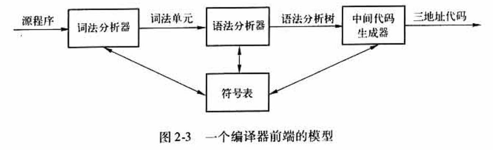

# 编译原理

## 第1章 引论

程序设计语言是向人以及计算机描述计算过程的记号

### 1.1 语言处理器

- 一个 **[编译器（compiler）](https://zh.wikipedia.org/wiki/%E7%B7%A8%E8%AD%AF%E5%99%A8)** 就是一个程序，它可以阅读以某一种语言（源语言）编写的程序，并把该程序翻译成一个等价的、用另一个语言（目标语言）编写的程序

- 编译器的重要任务之一是 **报告它在翻译过程中发现的源程序中的错误**

- **[解释器（interpreter）](https://zh.wikipedia.org/wiki/%E7%9B%B4%E8%AD%AF%E5%99%A8)** 是另一种常见的语言处理器。它并不通过翻译的方式生成目标程序，直接利用用户提供的输入执行源程序中指定的操作

### 1.2 一个编译器的结构

1. 编译器由两个部分组成：**分析部分** 和 **综合部分**

- **分析（analysis）部分** 把源程序分解成为多个组成要素，并在这些要素之上加上语法结构，然后使用这个结构来创建该源程序的一个 **中间表示**

- **综合（synthesis）部分**根据 **中间表示** 和 **符号表** 中的信息来构造用户期待的 **目标程序**

- **分析部分** 经常被称为编译器的 **前端（front end）**，**综合部分** 称为 **后端（back end）**

2. 编译器执行了一组 **步骤（phase）**，每个步骤把源程序的一种表示方式转换成另一种表示方式：

- **步骤**：

   1. **词法分析**

      第一个步骤称为 **词法分析（lexical analysis）** 或 **扫描（scanning）**。词法分析器读入组成源程序的**字符流**，并且将它们组织成有意义的 **词素（lexeme）** 序列。对于每个词素，词法分析器产生如下形式的 **词法单元（token）** 作为输出：`<token-name, attribute-value>`

      - 在这个词法单元中，第一个分量`token-name`是一个由语法分析步骤使用的抽象符号，第二个分量`attribute-value`指向符号表中关于这个词法单元的条目

   2. **语法分析**

      第二个步骤称为 **语法分析（syntax analysis）** 或 **解析（parsing）**。语法分析器使用由词法分析器生成的各个词法单元的第一个分量来创建 **树形** 的 **中间表示**

      - 常用的表示方法是**语法树（syntax tree）**，树中的每个内部结点表示一个运算，而该结点的子结点表示该运算的分量

   3. **语义分析**

      **语义分析器（semantic analyzer）** 使用**语法树**和**符号表**中的信息来检查源程序是否和语言定义的语义一致

      - 语义分析的一个重要部分是 **类型检查（type checking）**，编译器检查每个运算符是否具有匹配的运算分量

   4. **中间代码生成**

      在把一个源程序翻译成目标代码的过程中，一个编译器可能构造出一个或多个中间表示

   5. **代码优化**

      机器无关的代码优化步骤试图改进中间代码，以便生成更好的目标代码

   6. **代码生成**

      代码生成器以源程序的中间表示形式作为输入，并把它映射到目标语言

- 符号表管理

  编译器的重要功能之一是记录源程序中使用的变量的名字，并收集和每个名字的各种属性有关的信息

- 将多个步骤组合成趟

  在一个特定的实现中，多个步骤的活动可以被组合成一 **趟（pass）**。每趟读入一个输入文件并产生一个输出文件

### 1.3 程序设计语言的发展历程

- 第一代语言是 **机器语言**，第二代语言是 **汇编语言**，而第三代语言是 **Fortran**、**Cobol**、**Lisp**、**C**、**C++**、**C#**及**Java** 这样的 **高级程序设计语言**。第四代语言 **是为特定应用设计的语言**

- 另一种语言分类方式把程序中指明 **如何完成一个计算任务的语言** 称为 **强制式（imperative）** 语言，而把程序中指明 **要进行哪些计算的语言** 称为 **声明式（declarative）** 语言

- 术语 **冯•洛伊曼语言（von Neumann language）** 是指以冯•洛伊曼计算机体系结构为计算模型的程序设计语言

- **[面向对象语言（object-oriented language）](https://zh.wikipedia.org/wiki/%E9%9D%A2%E5%90%91%E5%AF%B9%E8%B1%A1%E7%A8%8B%E5%BA%8F%E8%AE%BE%E8%AE%A1)** 指的是支持 **面向对象编程** 的语言，**面向对象编程是指** 用一组相互作用的对象组成程序的编程风格

- **[脚本语言（scripting language）](https://zh.wikipedia.org/wiki/%E8%84%9A%E6%9C%AC%E8%AF%AD%E8%A8%80)** 是具有高层次运算符的 **解释型** 语言，它通常被用于把多个计算过程“ **粘合** ”在一起

### 1.4 构建一个编译器的相关科学

编译器的设计中有很多通过数学方法抽象出问题本质从而解决现实世界中复杂问题的完美例子

1. 编译器设计和实现中的建模

   对编译器的研究主要是有关如何设计正确的数学模型和选择正确算法的研究。设计和选择时，还需要考虑到对通用性及功能的要求与简单性及有效性之间的平衡

   最基本的数学模型是 **[有穷状态自动机](https://zh.wikipedia.org/wiki/%E7%A1%AE%E5%AE%9A%E6%9C%89%E9%99%90%E7%8A%B6%E6%80%81%E8%87%AA%E5%8A%A8%E6%9C%BA)**、**[正则表达式](https://zh.wikipedia.org/wiki/%E6%AD%A3%E5%88%99%E8%A1%A8%E8%BE%BE%E5%BC%8F)**、**[上下文无关文法](https://zh.wikipedia.org/wiki/%E4%B8%8A%E4%B8%8B%E6%96%87%E6%97%A0%E5%85%B3%E6%96%87%E6%B3%95)**、**[树形结构](https://zh.wikipedia.org/wiki/%E6%A8%B9%E7%8B%80%E7%B5%90%E6%A7%8B)**

2. 代码优化的科学

- 在编译器设计中，术语“优化”是指编译器为了生成比较浅显直观的代码更加高效的代码而做的工作

- **编译器优化必须满足下面的设计目标：**
  - 优化必须是正确的，也就是说，不能改变被编译程序的含义
  - 优化必须能够改善很多程序的性能
  - 优化所需的时间必须保持在合理的范围内
  - 所需要的工程方面的工作必须是可管理的

### 1.5 编译技术的应用

编译器设计并不只是关于编译器的

1. 高级程序设计语言的实现

2. 针对计算机体系结构的优化

   几乎所有高性能系统都利用了两种技术：**并行（parallelism）** 和 **内存层次结构（memory hierarchy）**

3. 新计算机体系结构的设计
4. 程序翻译
5. 软件生产率工具

### 1.6 程序设计语言基础

1. **静态和动态的区别**

- 如果一个语言使用的策略支持编译器静态决定某个问题，那么我们说这个语言使用了一个 **静态（static）策略**，或者说这个问题可以在 **编译时刻（compile time）** 决定。另一方面，一个只允许在运行程序的时候做出决定的策略被称为 **动态策略（dynamic policy）**，或者被认为需要在 **运行时刻（run time）** 做出决定
- x 的一个声明的 **作用域（scope）** 是指程序的一个区域，在其中对 x 的使用都指向这个声明。如果仅通过阅读程序就可以确定一个声明的作用域，那么这个语言使用的是 **静态作用域（static scope）**，或者说 **词法作用域（lexical scope）**。否则，这个语言使用的是 **动态作用域（dynamic scope）**。

2. **环境与状态**

- **环境（environment）** 是一个从名字到存储位置的映射
- **状态（state）** 是一个从内存位置到它们的值的映射

3. **静态作用域和块结构**

   包括 C 语言和它的同类语言在内的大多数语言使用静态作用域，C 语言的作用域规则是基于程序结构的，一个声明的作用域由该声明在程序中出现的位置隐含地决定

	> 名字、标识符和变量
	>
	> 虽然术语“名字”和“变量”通常指的是同一个事物，我们还是要很小心地使用它们，以便区别编译时刻的名字和名字在运行时刻所指的内存位置。
	>
	> **标识符（identifier）** 是一个字符串，通常由字母和数字组成。它用来指向（标记）一个实体，比如一个数据对象、过程、类、或者类型。所有的标识符都是名字，但并不是所有的名字都是标识符。名字也可以是一个表达式。比如名字 *x.y* 可以表示 *x* 所指的一个结构中的字段 *y*。这里，*x* 和 *y* 是标识符，而 *x.y* 是一个名字。像 *x.y* 这样的复合名字称为 **受限名字（qualified name）**。
	>
	> **变量** 指向存储中的某个特定的位置。同一个标识符被多次声明是很常见的事情，每一个这样的声明引入一个新的变量。即使每个标识符只被声明一次，一个递归过程中的局部标识符将在不同的时刻指向不同的存储位置。

4. **显示访问控制**

   类和结构为它们的成员引入了新的作用域

	> 声明和定义
	>
	> 程序设计语言概念中的两个看起来相似的属于“声明”和“定义”实际上有着很大的不同。声明告诉我们事物的类型，而定义告诉我们它们的值。因此，`int i`是一个 *i* 的声明，而`i = 1`是 *i* 的一个定义（定值）。
	>
	> 当我们处理方法或者其他过程时，这个区别就更加明显。在 C++ 中，通过给出了方法的参数及结果的类型（通常称为该方法的范型），在类的定义中声明这个方法。然后，这个方法在另一个地方被定义，即在另一个地方给出了执行这个方法的代码。类似地，我们会经常看到在一个文件中定义了一个 C 语言的函数，然后在其它使用这个函数的文件中声明这个函数。

5. **动态作用域**

   从技术上讲，如果一个作用域策略依赖于一个或多个只有在程序执行时刻才能知道的因素，它就是动态的

6. **参数传递机制**

- **值调用**

  在 **值调用（call-by-value）** 中，会对实在参数求值（如果它是表达式）或拷贝（如果它是变量）

- **引用调用**

  在 **引用调用（call-by-reference）** 中，实在参数的地址作为相应的参数的值被传递给调用者

- **名调用**

  它要求被调用者的运行方式好像是用实在参数以字面方式替换了被调用者的代码中的形式参数一样

7. **别名**

   引用调用或者其他类似的方法，比如像 Java 中那样把对象的引用当作值传递，会引起一个有趣的结果。有可能两个形式参数指向同一个位置，这样的变量称为另一个变量的 **别名（alias）**。

### 1.7 第1章总结

- **语言处理器**：一个集成的软件开发环境，其中包括很多种类的语言处理器，比如编译器、解释器、汇编器、连接器、加载器、调试器以及程序概要提取工具
- **编译器的步骤**：一个编译器的运作需要一系列的步骤，每个步骤把源程序从一个中间表示转换成另一个中间表示
- **机器语言和汇编语言**：机器语言是第一代程序设计语言，然后是汇编语言。使用这些语言进行编程既费时，有容易出错
- **编译器设计中的建模**：编译器设计是理论对实践有很大影响的领域之一。已知在编译器设计中有用的模型包括自动机、文法、正则表达式、树形结构和很多其他理论概念
- **代码优化**：虽然代码不能真正达到最优化，但提高代码效率的科学既复杂又非常重要。它是编译技术研究的一个主要部分
- **高级语言**：随着时间的流逝，程序设计语言担负了越来越多的原先由程序员负责的任务，比如内存管理、类型一致性检查或代码的并发执行
- **编译器和计算机体系结构**：编译器技术影响了计算机的体系结构，同时也受到体系结构发展的影响。体系结构中的很多现代创新都依赖于编译器能够从源程序中抽取出有效利用硬件能力的机会
- **软件生产率和软件安全性**：使得编译器能够优化代码的技术同样能够用于多种不同的程序分析任务。这些任务既包括探测常见的程序错误，也包括发现程序可能会受到已被黑客们发现的多种入侵方式之一的侵害
- **作用域规则**：一个 *x* 的声明的作用域是一段上下文，在此上下文中对 *x* 的使用指向这个声明。如果仅仅通过阅读某个语言的程序就可以确定其作用域，那么这个语言就使用了 **静态作用域**，或者说 **词法作用域**。否则这个语言就是用了 **动态作用域**
- **环境**：名字和内存位置关联，然后再和值相关联。这个情况可以使用 **环境** 和 **状态** 来描述。其中环境把名字映射成为存储位置，而状态则把位置映射到它的值
- **块结构**：允许语句块互相嵌套的语言成为 **块结构** 的语言。假设一个块中有一个 *x* 的声明 *D*，而嵌套于这个块中的块 *B* 中有一个对名字 *x* 的使用。如果在这两个块之间没有其他声明了 *x* 的块，那么这个 *x* 的使用位于 *D* 的作用域内
- **参数传递**：参数可以通过值或引用的方式从调用过程传递给被调用过程。当通过值传递方式传递大型对象时，实际被传递的值是指向这些对象本身的引用。这样就变成了一个高效的引用调用
- **别名**：当参数被以引用传递方式（高效地）传递时，两个形式参数可能会指向同一个对象。这会造成一个变量的修改改变了另一个变量的值

## 第2章 一个简单的语法制导翻译器

### 2.1 引言

编译器在分析阶段把一个源程序划分成各个组成部分，并生成源程序的内部表示形式。这种内部表示称为中间代码。然后，编译器在合成阶段将这个中间代码翻译成目标程序

一个编译器前端的模型如下图：

### 2.2 语法定义

文法自然地描述了大多数程序设计语言构造的层次化语法结构。例如：

*stmt* → **if** ( *expr* ) *stmt* **else** *stmt*

这样的规则称为 **产生式（production）**。在一个产生式中，像关键字 **if** 和括号这样的词法元素称为 **终结符号（terminal）**。像 *expr* 和 *stmt* 这样的变量表示终结符号的序列，它们称为 **非终结符号（nonterminal）**

1. **文法定义**

   一个 **上下文无关文法（context-free grammar）** 由四个元素组成：

   1. 一个 **终结符号** 集合，它们有时也称为”词法单元“。终结符号是该文法所定义的语言的基本符号的集合
   2. 一个 **非终结符号** 集合，它们有时也称为”语法变量“。每个非终结符号表示一个终结符号串的集合
   3. 一个 **产生式** 集合，其中每个产生式包括一个称为 **产生式头** 或 **左部** 的非终结符号，一个箭头，和一个称为 **产生式体** 或 **右部** 的由终结符号及非终结符号组成的序列
   4. 指定一个非终结符号为 **开始** 符号

2. **推导**

- 根据文法推导符号串时，我们首先从开始符号出发，不断将某个非终结符号替换为该非终结符号的某个产生式的体。可以从开始符号推导得到的所有终结符号串的集合称为该文法定义的 **语言（language）**
- **语法分析（parsing）** 的任务是：接受一个终结符号串作为输入，找出从文法的开始符号推导出这个串的方法。如果不能从文法的开始符号推导得到该终结符号串，则报告该终结符号串中包含的语法错误

3. **语法分析树**

   给定一个上下文无关文法，该文法的一棵 **语法分析树（parse tree）** 是具有以下性质的树：

   1. 根结点的标号为文法的开始符号
   2. 每个叶子接点的标号为一个终结符号或 **ε**
   3. 每个内部结点的标号为一个非终结符号
   4. 如果非终结符号 *A* 是某个内部结点的标号，并且它的子结点的标号从左至右分别为 *X*1，*X*2，…，*X*n，那么必然存在产生式 *A*→*X*1*X*2…*X*n，其中 *X*1，*X*2，…，*X*n 既可以是终结符号，也可以是非终结符号。作为一个特殊情况，如果 *A*→**ε** 是一个产生式，那么一个标号为 *A* 的结点可以只有一个标号为**ε**的子结点

​	*一个文法的语言的另一个定义是指任何能够由某棵语法分析树生成的符号串的集合，为一个给定的终结符号串构建一棵语法分析树的过程称为对该符号串进行 **语法分析***

4. **二义性**

   一个文法可能有多棵语法分析树能够生成同一个给定的终结符号串。这样的文法称为具有 **二义性（ambiguous）**

5. **运算符的结合性**

   一般来说，加、减、乘、除是左 **结合（associate）**

   赋值运算符“=”是右结合

6. **运算符的优先级**

   结合性规则只能作用于同一运算符的多次出现，因此它们无法解决不同运算符之间的二义性问题。为此，当多种运算符出现时，我们需要给出一些规则来定义运算符之间的相对优先关系

### 2.3 语法制导翻译

语法制导翻译是通过向一个文法的产生式附加一些规则或程序片段而得到的

- **属性（attribute）**：属性表示与某个程序构造相关的任意的量。属性可以是多种多样的，比如表达式的数据类型、生成的代码中的指令数目或为某个构造生成的代码中第一条指令的位置等等都是属性的例子。因为我们用文法符号（终结符号或非终结符号）来表示程序构造，所以我们将属性的概念从程序构造扩展到表示这些构造的文法符号上
- **（语法制导的）翻译方案（translation scheme）**：翻译方案是一种将是程序片段附加到一个文法的各个产生式上的表示法。当在语法分析过程中使用一个产生式时，相应的程序片段就会执行。这些程序片段的执行效果按照语法分析过程的顺序组合起来，得到的结果就是这次分析/综合过程处理源程序得到的翻译结果

1. **后缀表示**

    一个表达式 ***E*** 的 **后缀表示（postfix notation）** 可以按照下面的方式进行归纳定义：

    1. 如果 ***E*** 是一个变量或常量，则 ***E*** 的后缀表示是 ***E*** 本身

    2. 如果 ***E*** 是一个形如 ***E***1 **op** ***E***2 的表达式，其中 **op** 是一个二目运算符，那么 ***E*** 的后缀表示是 ***E'***1***E'***2**op**，这里 ***E'***1 和 ***E'***2 分别是 ***E***1 和 ***E***2 的后缀表示

    3. 如果 ***E*** 是一个形如 ( ***E***1 ) 的被括号括起来的表达式，则 ***E*** 的后缀表示就是 ***E***1 的后缀表示

2. **综合属性**

- **语法制导定义（syntax-directed definition）** 把①每个文法符号和一个属性集合相关联，并且把②每个产生式和一组 语义规则（semantic rule）** 相关联，这些规则用于计算与该产生式中符号相关联的属性值

    
- 如果某个属性在语法分析树结点 *N* 上的值是由 *N* 的子结点以及 *N* 本身的属性值确定的，那么这个属性就称为 **综合属性（synthesized attribute）**。综合属性具有一个很好的性质：只需要对语法分析树进行一次自底向上的遍历，就可以计算出属性的值。另一个重要的属性是 **“继承”属性**，继承属性在某个语法分析树结点上的值是由语法分析树中该结点本身、父结点以及兄弟结点上的属性值决定的

3. **简单语法制导定义**

   要得到代表产生式头部的非终结符号的翻译结果的字符串，只需要将产生式体中各非终结符号的翻译结果按照它们在非终结符号中的出现顺序连接起来，并在其中穿插一些附加的串即可。具有这个性质的语法制导定义称为 **简单（simple）** 语法制导定义

4. **树的遍历**

   树的遍历将用于描述属性的求值过程，以及描述一个翻译方案中的各个代码片段的执行过程。一个树的 **遍历（traversal）** 从根结点开始，并按照某个顺序访问树的各个结点

5. **翻译方案**

   语法制导翻译方案是一种在文法产生式中附加一些程序片段来描述结果的表示方法。语法制导翻译方案和语法制导定义相似，只是显示指定了语义规则的计算顺序

   被嵌入到产生式体中的程序片段称为 **语义动作（semantic action）**。一个语义动作用花括号括起来，并写入产生式的体中，它的执行位置也由此指定，如下：

   *rest* → + *term* | print('+') | *rest*1
   
